# Public Shelter Internet

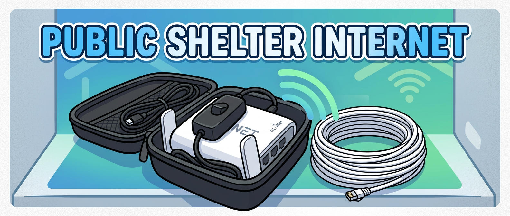

A DIY portable kit for bringing internet connectivity into underground public bomb shelters in Israel, where concrete construction blocks cellular and Wi-Fi signals.

## How It Works

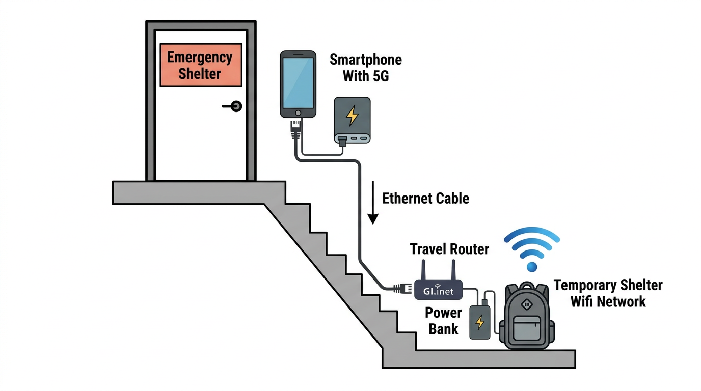

## The Problem

To be effective at stopping missiles, underground public shelters involve lots of concrete. Concrete does not love RF waves.

30% of Israelis do not have a protected space (mamad) in their homes. Israel relies primarily upon a smartphone app (Home Front Command) and wireless emergency alerts (WEA / cell broadcast) to send vital notifications to those sheltering in place.

Both of these notifications share a single point of failure: **internet connectivity**.

Many public shelters are dilapidated and besides lacking connectivity lack power outlets. People sheltering are often left to guess when an official all-clear has been issued by the Home Front Command. Unfortunately people tend to resort to guesstimates and leave shelter prematurely, risking shrapnel.

## One Possible Solution

A backpack-portable kit that uses an Android phone's cellular connection, shared over a wired ethernet run into the shelter, and rebroadcast as Wi-Fi by a travel router.

### Parts List

- An old but not too old Android phone (with 5G)
- A GL.iNet travel router (I use the GL-SFT1200 Opal)
- A USB-C to ethernet adapter (with USB-C to USB-A converter)
- A small power bank
- A 20M ethernet cable
- A zippered carry case (mine was originally for a microphone)
- Superglue
- USB switch (to turn the router on/off between uses)
- Velcro ties / cable ties

### The Kit

| | |
|---|---|
| 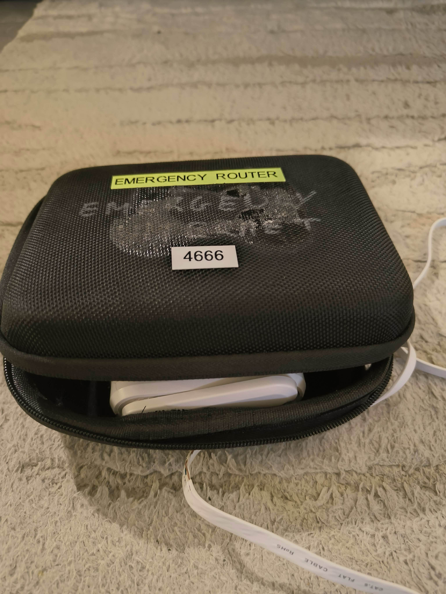 | 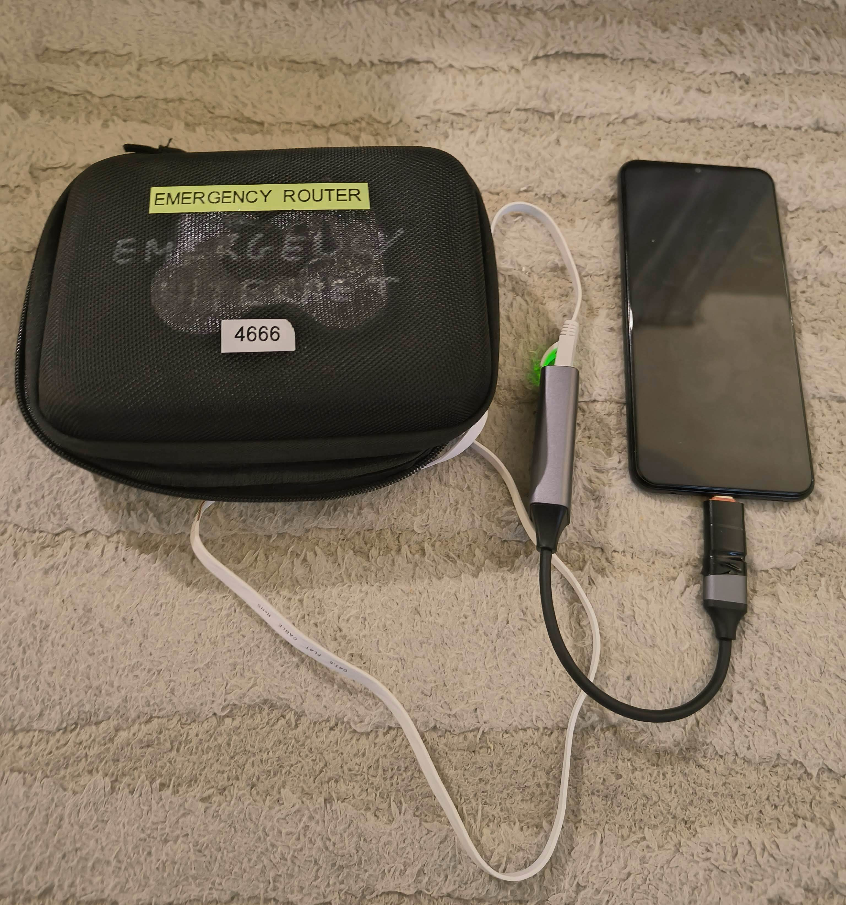 |
| *Carry case, labeled and closed* | *Case connected to phone via ethernet adapter* |
| 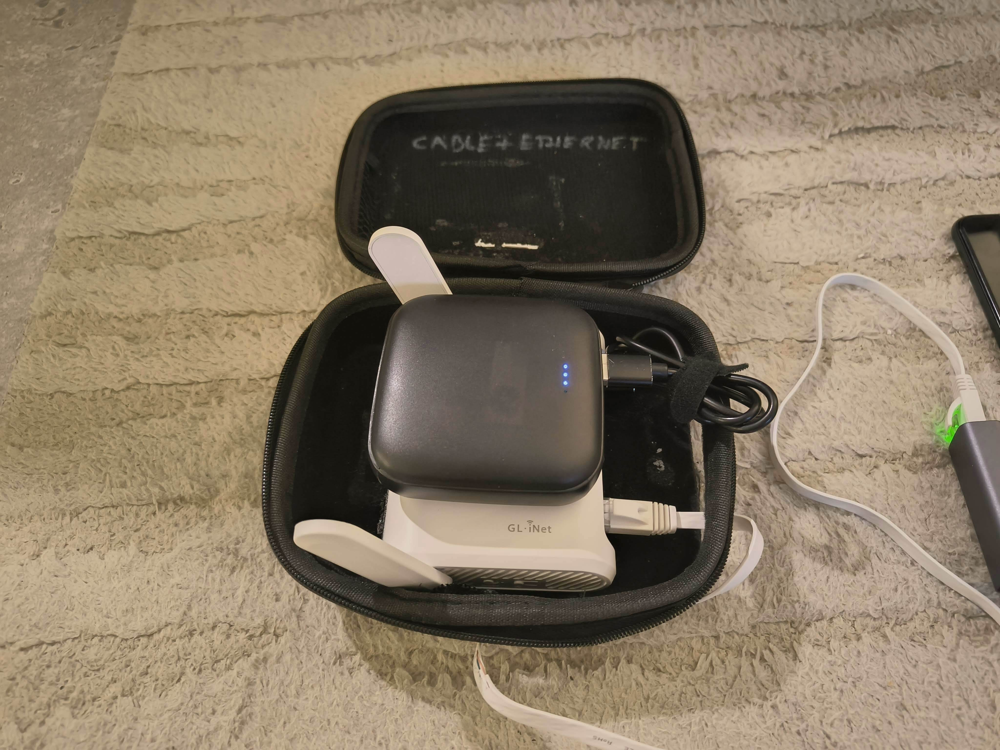 | 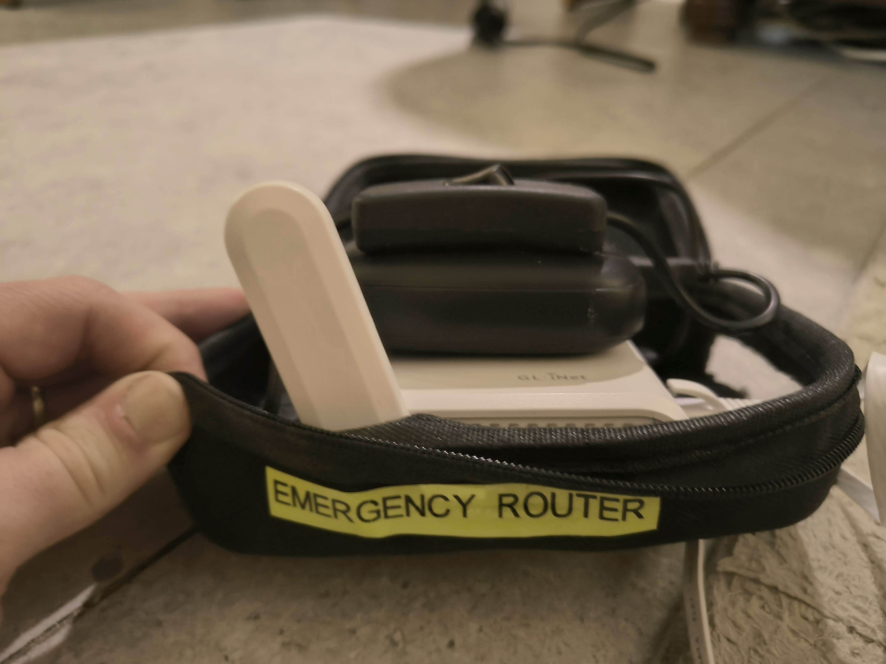 |
| *Case open showing router and power bank* | *Router antenna poking out of case* |
| 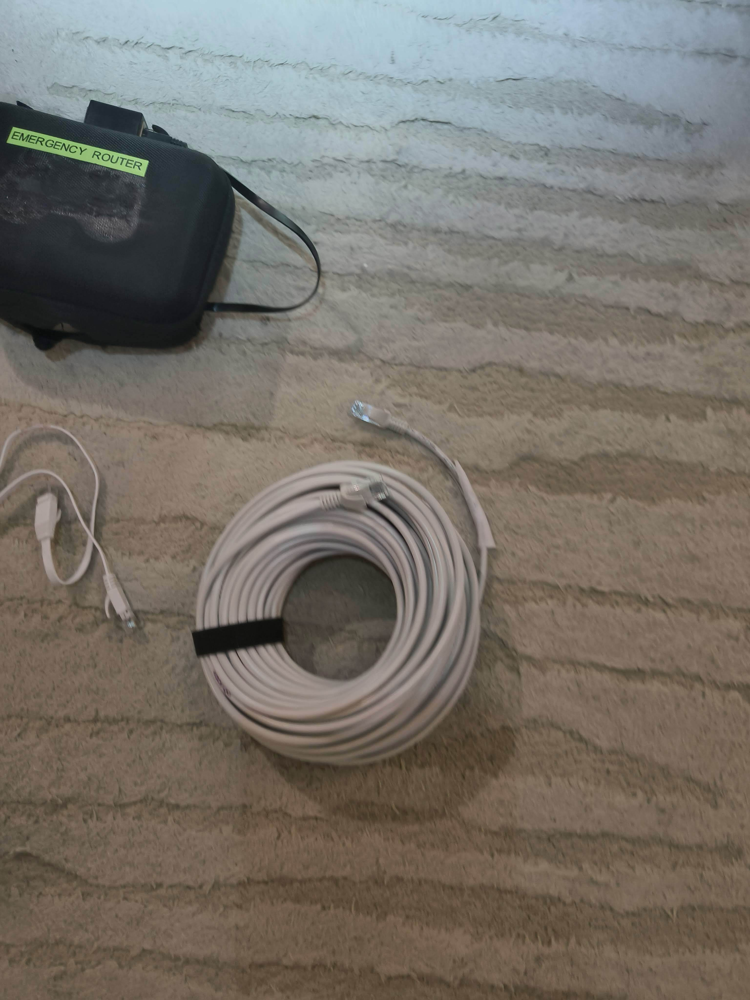 | 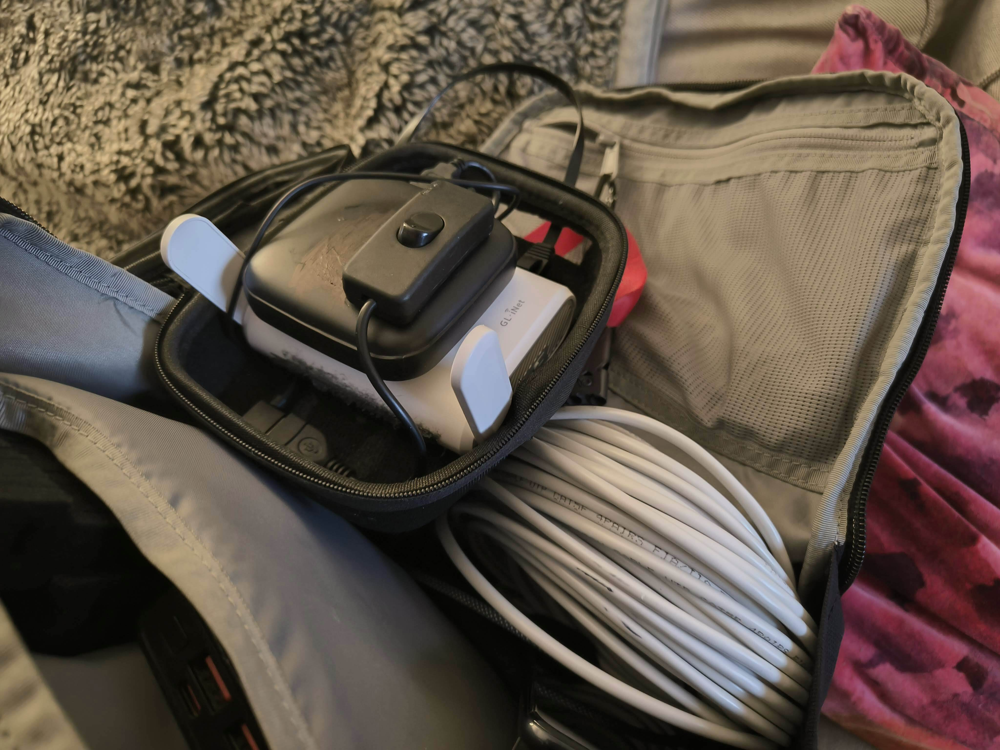 |
| *Full kit with 20M ethernet cable* | *Everything fits in a backpack* |

## Setup

### Phone Configuration

1. Connect the USB-C to ethernet adapter to the phone
2. Go to **Settings > Connections > Ethernet** and enable it
3. Set connection type to **DHCP**
4. Enable **Ethernet tethering** (Settings > Mobile Hotspot and Tethering)
5. **Disable Wi-Fi hotspot** — keep all bandwidth for the wired run

| | |
|---|---|
| 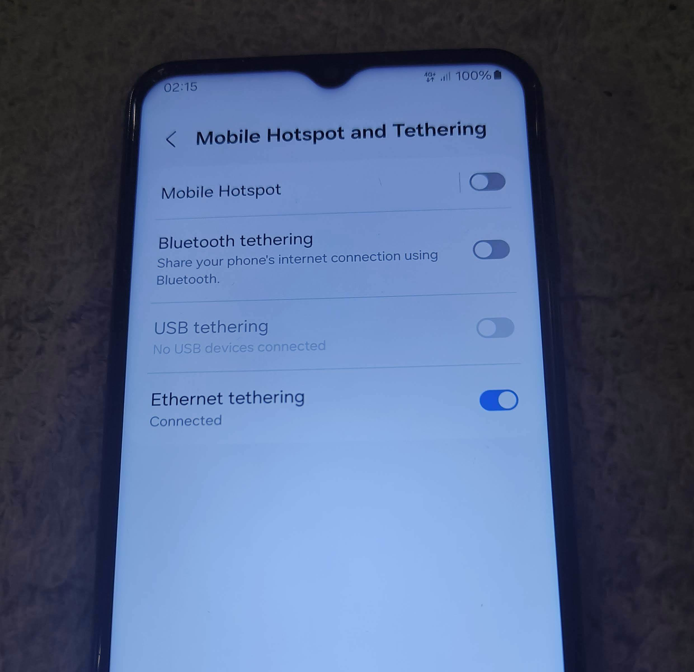 | 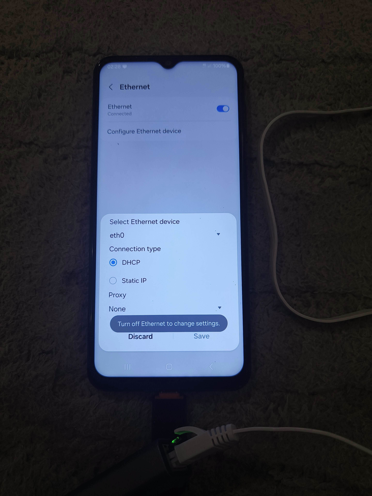 |
| *Enable ethernet tethering, disable all others* | *Ethernet enabled with DHCP on eth0* |
| 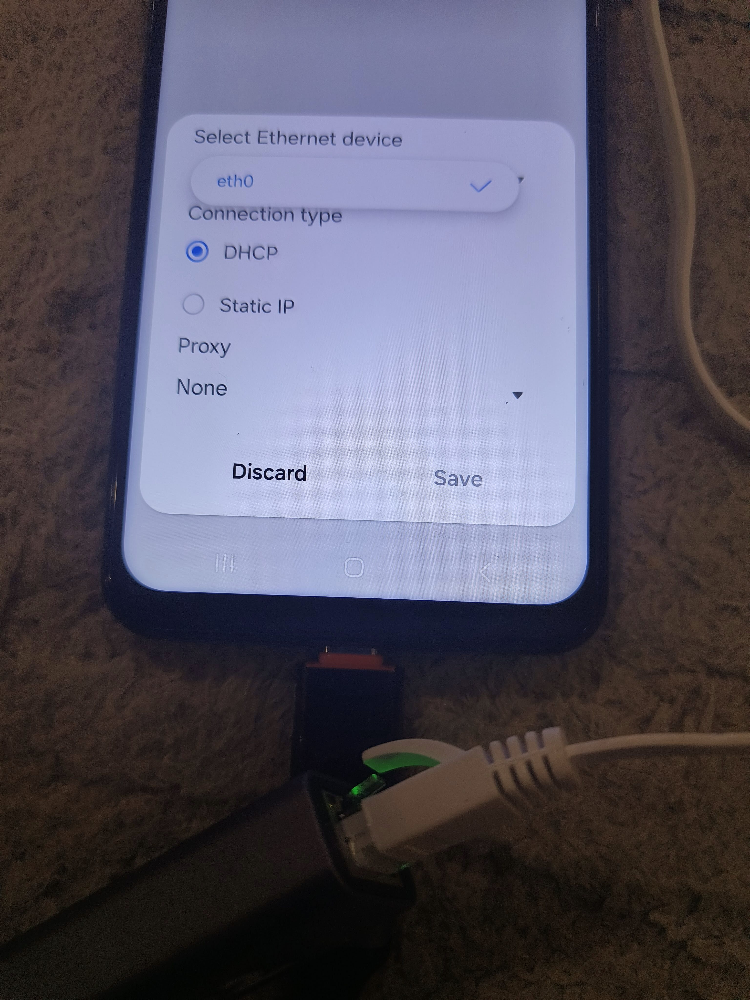 | 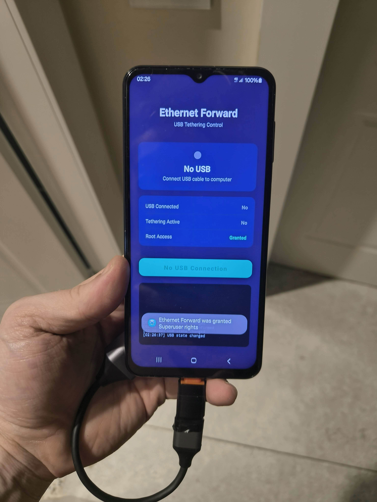 |
| *DHCP configuration detail* | *Ethernet Forward app (alternative method)* |

### Physical Setup

1. Position the Android phone near the top of the shelter stairs (best cellular signal)
2. Connect phone to ethernet adapter, run cable down the stairwell
3. Connect ethernet cable to the WAN port on the GL.iNet router
4. The router broadcasts a Wi-Fi network inside the shelter

| | |
|---|---|
|  |  |
| *Router and power bank deployed at shelter entrance* | *GL.iNet router sitting on power bank* |
| 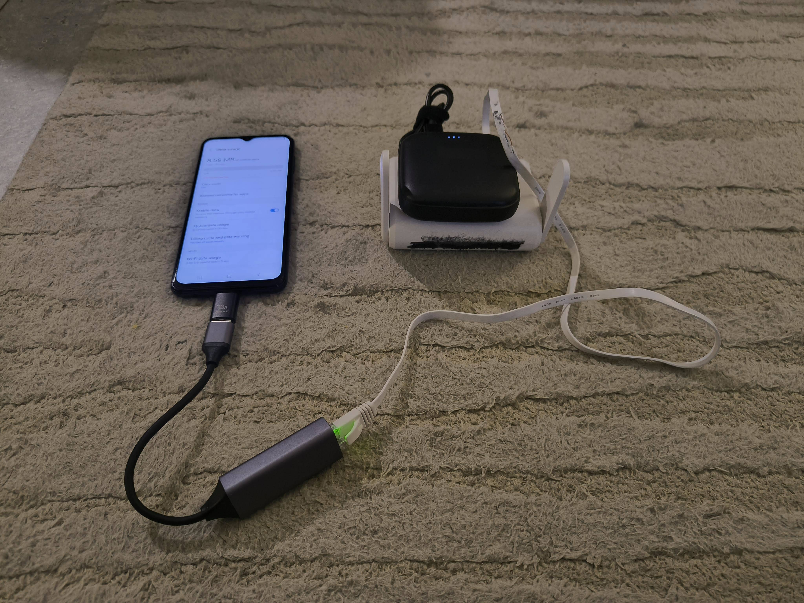 | 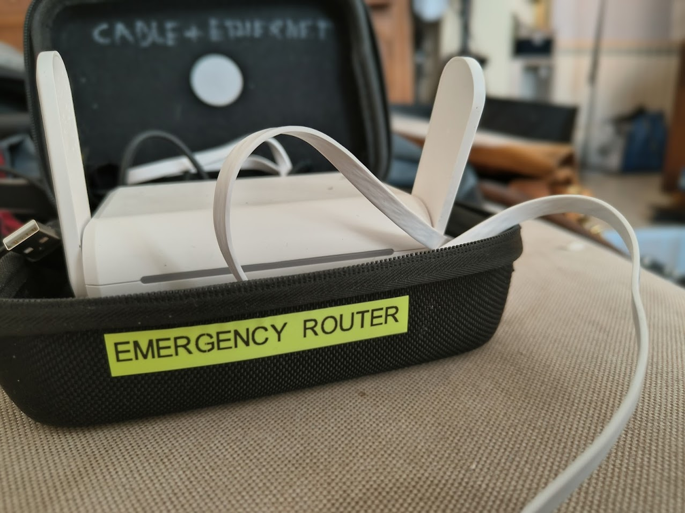 |
| *Complete setup: phone to adapter to router* | *Router broadcasting from case* |

### Simpler Setup (Shelter With Ethernet But No Wi-Fi)

Some newer or better-maintained shelters have an ethernet access point on the wall but still no Wi-Fi. In this case the setup is much simpler: just connect the GL.iNet router directly to the wall jack and it will broadcast Wi-Fi from the existing wired connection — no phone or tethering needed.

| | |
|---|---|
|  |  |
| *Router and power bank connected to shelter's ethernet jack* | *GL.iNet router powered by power bank, connected to wall port* |

### Laying the Ethernet Cable (No Existing Infrastructure)

Assumption: you're using a shelter consistently and it doesn't have internet.

You're not going to be running ethernet cable in an emergency. Nor do you want to create a trip hazard. Set this up **between alerts**.

- Secure the ethernet cable along the stairs/railings ensuring it doesn't impede the stairwell
- The carry case has an ethernet male-to-female coupler on the outside — connect the router when required
- If using an old Android you've accepted might be stolen: wipe it beforehand, set it up without apps/data, and leave it somewhere inconspicuous

## During an Alert

1. Grab backpack with internet kit
2. Plug the ethernet cable into the case coupler
3. Turn on the power bank (keep it charged between uses, turn it off after)
4. The router broadcasts Wi-Fi inside the shelter
5. When positioned right outside the shelter door, the signal usually propagates inside

## Extending Coverage

You can extend this significantly by adding additional GL.iNet travel routers in **repeater mode**:

| | |
|---|---|
|  |  |
| *Mesh setup with smartphone, relay node, and access point* | *Detailed mesh topology with 2 GL.iNet routers* |

- Each repeater needs power (a power bank works; more advanced models need a PD-to-DC cable)
- Disable auto network switching on all nodes
- Hide the SSID on the first node (the phone) to prevent accidental connections
- Disable 5 GHz to save power
- Use a consistent, manually set Wi-Fi channel to enable reliable propagation between nodes

## Build Tips

- Use superglue to attach the power bank and router together — you learn quickly when running between shelters that you want everything secure with no moving parts coming loose
- A USB switch lets you turn the router on/off without disconnecting anything
- Velcro ties keep cables managed inside the case

